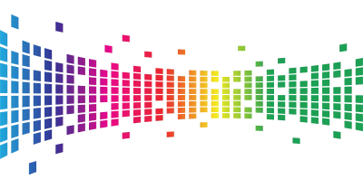

*(This is how our homepage would look if we had opted to use MARKDOWN for it. Obviously, the markdown document can contain HTML.)*

&nbsp;

&nbsp;

## What is WEIRD?

  

WEIRD is a multi-modal web framework.

It converts documents (HTML, markdown, or even Word documents) into websites through a series of Python-meets-JS shenanigans.

Yeah, we get it. WEIRD is weird. But it can easily produce surprisingly good (and fairly sustainable) websites from little more than just a few documents (even Word documents!).

Download and try WEIRD from its [dedicated GitHub repo](https://github.com/jbolns/WEIRD).

*If we were better at marketing, we'd say something like **'blogging reinvented'**.*

&nbsp;

&nbsp;

&nbsp;

## Key features
### Multi-modal
Pages and blogs can be created in HTML, markdown, and Word. It is also possible to combine formats.

Potential benefits:

*	Small-to-medium websites in no time.
*	Easier to integrate dumps form data analytics.
*	Rapid publishing of long-format documents.
### A solid foundation
Customisation is possible but not necessary. Without additional customisation, WEIRD produces a site like this one.

Potential benefits:

*	Small-to-medium websites in no time, even from Word documents.
*	Painless way to launch project websites.
*	A way for Python developers to easily create full websites.
### Expandable
WEIRD can be expanded and customised using CSS/JS, jQuery (pre-installed), Bootstrap (pre-installed), and other libraries (upon import).

Potential benefits:

*	An interpretable framework.
*	Multiple design approaches possible.
*	Imagination is the limit.
### Fast!
Depending on how you approach it, WEIRD websites can be incredibly fast and fairly sustainable.

Potential benefits:

*	Improved user experience.
*	Outstanding performance metrics.
*	Excellent sustainability scores.

&nbsp;

&nbsp;

&nbsp;

&nbsp;

## Use cases
### Small to medium websites.
WEIRD generates static websites, even from Word documents. These are excellent for SME websites, portfolios, project sites, event websites, documentation pages, marketing websites, and landing pages.

### Painless blogging
Since WEIRD is multi-modal, you can design key sections using HTML, CSS, JS, and markdown, yet blog easily by simply uploading Word documents.

### Sustainable websites
WEIRD can produce more sustainable websites that emit less carbon emissions than the average. WEIRD is therefore optimal for anyone interested in the environment and/or demonstrating a commitment to sustainability.

&nbsp;

&nbsp;

&nbsp;

## License
WEIRD is a product by [polyzentrik.com](https://www.polyzentrik.com/), released under an Apache 2.0 open source license.

We kindly ask you to leave the branding in the footer intact or [make a small voluntary payment via our main website](https://www.polyzentrik.com/help-us-help/) if you wish to remove it.

